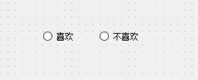
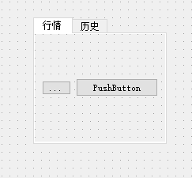
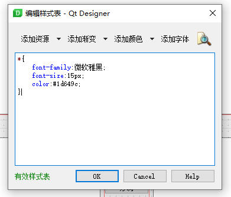
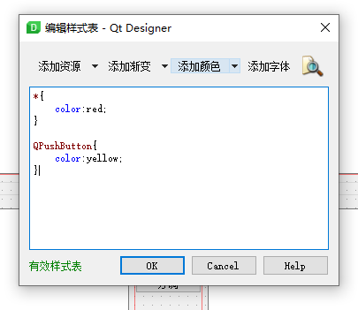
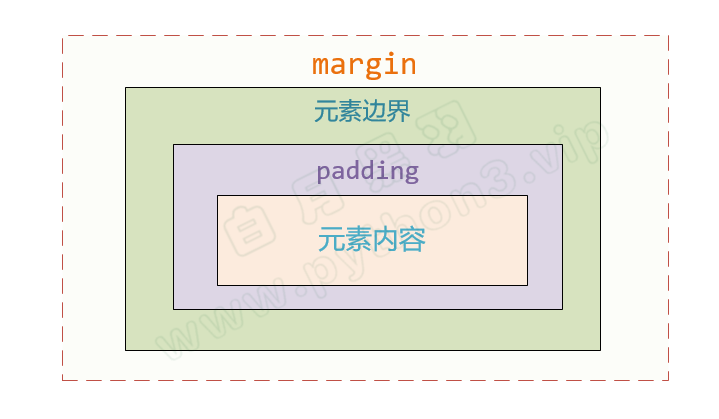

## 安装PySide2与使用

- pip install pyside2
- 安装包路径找到pysiede2的文件，打开designer.exe就可以自己编辑
- 新建widget窗口，左边可以添加各种控件
- 右边可以给控件窗口改名设置参数，属性栏是从高类到低类

## 常用控件（名字在objectname中）

- Push Buttons 按钮

  - 点击按钮激活语句：
  	- `B.clicked.connect(方法名(不带括号))`

- Radio Button 按钮

    <center>
    
    Radio Button
    </center>

     	- 如果想把几个Radio Button按钮放在一组，需要将这几个按钮选中之后，
    	
    	**右键 -> 指定到按钮组 -> 新建按钮组**
    	
     - 取消按钮组的话，
     **右键 -> 按钮组XXX -> 打断**

     - 也可以通过布局的的方法把几个Radio Button放一组

     - 也可以把几个Radio Button拖入到一个Group Box里

- Tab Widget

    <center>
    
    Tab Widget
    </center>

    - 设置Tab布局：先选中Tab，然后在他的上层tabWidget右键布局
    - 设置Tab名：选中Tab，修改currentTabText属性为 ‘‘行情’’
    - 增加Tab栏，选中一个栏，右键插入页

## 保存与映射
编辑好的界面点击保存，pycharm中映射语句，（下面三个是一个程序，分开写了）e.g：

- 引用包： 
```python
from PySide2.QtWidgets import QApplication,QMessageBox
from PySide2.QtUiTools import QUiLoader
from PySide2.QtCore import QFile
```
- 生成类和方法（动态加载）：
```python
class Stats:

	def __init__(self):
		qfile_stats = QFile('ui/stats.ui')
		qfile_stats.open(QFile.ReadOnly)
		qfile_stats.close()

		self.ui = QUiLoader().load(qfile_stats)

		self.ui.b1.clicked.connect(self.haldeCalc) # b1是objectname

	def haldeCalc(self):
		indo = self.ui.TextEdit.toPlainText()

		print('按钮被点击了')
```
- 开启窗口（参考）
```python
app = QApplication([])
stats = Stats()
stats.ui.show()
app.exec_()
```

## 界面布局Layout

- Horizontal 水平布局
- Vertical 垂直布局
- Grid 表格布局
- Form 表单布局

**选中几个插件之后，右键布局即可**

### 布局思路

- 先不使用任何Layout，把所有控件 按位置 摆放在界面上
- 然后先从 最内层开始 进行控件的 Layout 设定
- 逐步拓展到外层 进行控件的 Layout设定
- 最后调整 layout中控件的大小比例，优先使用Layout的layoutStrentch属性来控制

## PyInstaller制作可执行文件

- `pip install pyinstaller`（exe文件在dist目录）
- `pyinstaller XXX.py`
  - 参数-F：表示打包成一个文件，否则打包成文件夹
  - 参数-w：是否显示命令行，一般程序如果不能运行，第一次打包，不加这个参数
  	- 当程序出错不运行时，进入dist，在命令行中运行XXX.exe
  		- 错误类型1：没有某个库（系统的）
  		  解决方法：
			1.在XXX.spec的hiddenimports中加入`'模块名'`（注意是字符串）
			2.`pyinstaller XXX.py --hidden-import 模块名`

		- 错误类型2：没有某个库（自己的）
		  需要将自己写的模块复制到Python安装路径下的Lib\site-packages目录中
		- 错误类型3：加载了ui文件，或者一些图片
			1.如果生成的是目录，则拷贝到对应即可
			或者在XXX.spec文件中的datas加入你的额外参数
			eg.`datas=[('5170.mp3', '.'),('5823.mp3', '.')]`其中`.`代表当前目录
			2.如果生成的是一个文件（没解决）

 - 参数-i：表示生成exe文件的图标，直接`pyinstaller -i XXX.ico XXX.py`即可

## 添加图标

- 主窗口图标
	- 添加如下代码
	
	```python
	from PySide2.QtGui import QIcon
	
	# 在 app = QApplication([]) 下边
	
	# 加载 icon
	app.setWindowIcon(QIcon('logo.png'))
	```
- exe文件图标
	- 将png文件转换成ico文件，网址为https://www.easyicon.net/covert/
	- `pyinstaller XXX.py --noconsole --hidden-import PySide2.QtXml --icon='logo.ico'`

## QSS (一个跟CSS很像的东西)

- 找到主窗口MainWindow的styleSheet属性，双击输入栏，点击右边...

  <center>
  
  </center>
  
  - \* 代表所有也可以是QPushButton等 
  - font-family 字体
  - font-size 大小
  - color 颜色

|Selector|&nbsp;示 例&nbsp;|&nbsp;说 明&nbsp;|
|:------:|:---------------:|:--------------:|
|Universal Selector |*|星号匹配所有的界面元素|
|Type Selector      |QPushButton              |选择所有 QPushButton类型 （包括其子类）         |
|Class Selector     |.QPushButton             |选择所有 QPushButton类型 ，但是不包括其子类      |
|ID Selector        |#okButton(QPushButton)   |选择所有 对象名为 okButton 的QPushButton类型    |
|Property Selector  |QPushButton[flat="false"]|选择所有 flat 属性值为 false 的 QPushButton类型 |
|Descendant Selector|QDialog QPushButton      |选择所有 QDialog 内部 QPushButton类型          |
|Child Selector     |QDialog > QPushButton    |选择所有 QDialog 直接子节点 QPushButton类型     |
|其他               |上述示例 : hover          |只有把鼠标放到所选控件上，才会改变     |

QPushButton[flat="false"]可以自己动态添加属性以及属性值，此处的属性为flat，属性值为false
多个属性的表示方法：

<center>

</center>


- margin和padding，都有四个参数，控制上下左右的宽度
 - 可以直接 magrin:10 10 10 10;
 - 也可以中 magrin-top , magrin-right , magrin-bottom , magrin-left 单独指定
<center>

</center>

## 将ui文件变成py文件
- 将ui文件变成py文件，命令行中在ui文件目录下执行如下语句
	`pyside2-uic main.ui > mian.py`
	main.ui是ui文件，main.py是py文件
- 在另一个文件中引用它
	```python
	from main import Ui_mainWindow
	
	class Stats(QtWidgets.QMainWindow):
	
	    def __init__(self):
	        super().__init__()
	        self.ui = Ui_mainWindow()
	        self.ui.setupUi(self)
	```


***

## PS

- 调节两个窗口百分比：layoutStretch